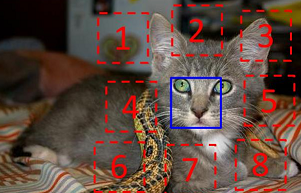

# OpenMMLab-AI训练营-2

图像分类与 MMClassification

## 1. 图像分类

**任务目标: 给定一张图片, 识别图像中的物体是什么.**

### 1.1 数学表示

图像是像素构成的HWC数组, 输出类别为$y∈{1, ..., K}$的向量.  
构建出一个可计算实现的函数$F: R^{H*W*C}-{1, ..., K}$, 且预测结果符合人类认知.

### 1.2 传统机器学习的难点

1. 收集数据;
2. 定义模型:
通常为含参变量的函数: $y = F_{\theta}(X)$;
3. 训练:
寻找最佳参数$\theta^*$, 使得模型$y = F_{\theta^*}(X)$在训练集上达到最佳正确率;
4. 预测:
对于新图像$\overline{X}$, 使用训练好的模型来预测其类别, $\overline{Y}=F_{\theta^*}(\overline{X})$.

机器学习的局限:  
机器学习善于处理低维, 分布相对简单的数据; 而图像数据在极高维的空间以复杂的方式"纠缠"在一起, 机器学习难以处理复杂数据分布.  

传统方法: 手动设计图像特征;  
特征学习: 学习如何产生适合分类的特征, 多个简单特征变换复合构成一个复杂的端到端分类器;  

### 1.3 基于模型的图像分类

1. 模型设计: 设计适合图像的F~θ~(X).
   1. 卷积神经网络;
   2. 轻量化卷积神经网络;
   3. 神经结构搜索;
   4. Transformer;
2. 模型学习: 求解一组好的参数~θ~.
   1. 监督学习: 基于标注数据学习
      1. 损失函数;
      2. 随机梯度下降算法;
      3. 视觉模型常用训练技巧
   2. 自监督学习: 基于无标注的数据学习.

### 1.4 卷积神经网络

1. AlexNet(2012): 开山之作.  
   使用了卷积层和全连接层; 使用ReLU大幅提高收敛速度; 实现和开源了cuda-convert, 能在GPU上训练;
2. 发展(2012~2014): 提升层数.
   1. VGG-19:  
    用多层3x3的卷积层代替大尺寸卷积, 带来更少的参数量,更多的层数和表达能力;  
    每隔几层倍增通道数、减半分辨率, 生成1/2、1/4尺度的更高抽象层次特征, 方便在位置敏感的下游任务, 如检测、分割中使用.  
    这就是所谓的backbone, 用于提取特征.
   2. GoogleLeNet:  
    使用Inception模块堆叠形成, 最终的分类仅使用单层全连接层, 可节省大量参数, 仅7M权重参数.  
3. 残差网络(2015)
   1. 精度退化问题: 模型层数增加到一定程度后, 分类正确率不增反降;
   2. 猜想: 常规优化算法难以找到理论上更高精度的模型, 让新增的卷积层拟合近似恒等映射, 能提升浅层网络的性能;
   3. 数学表达:
      1. 浅层网络: $y = F_{\theta}(X)$;
      2. 深层网络: $y = g_\theta(F_{\theta}(X))$;
      3. 残差网络: $y = (I + g_\theta)(F_{\theta}(X))$;
   4. ResNet中的两种残差模块:
      
4. 神经结构搜索 Neural Architecture Search (2016+)
   1. 基本思路: 借助强化学习等方法搜索出表现最佳的网络;
   2. 代表作: NASNet(2017), MnasNet(2018), EfficientNet(2019), RegNet(2020);
5. Vision Transformers: 使用NLP中的Transformer代替CNN, 精度更高
   1. 代表作: Vision Transformer(2020), Swin-Transformer(2021 ICCV 最佳论文);

### 1.5 轻量化卷积神经网络

#### 1.5.1 卷积参数量和计算量

1. 输入特征图$X \in R^{H*W*C}$;
2. 输出特征图$Y \in R^{H'*W'*C'}$;
3. $C'$ 个$C$ 通道的卷积核$K \in R^{C'*K*K*C}$;
4. $C'$ 个偏置值$b \in R^{C'}$.

- 卷积层训练参数: 卷积核和偏置值;
- 参数量$M=C'*(C*K*K+1)=C'CK^2+C'$;
- 输出特征图的每个元素都是输入特征图和1个卷积核进行卷积的结果;
- 计算量$N=H'*W'*C'*(C*K*K)=H'W'C'CK^2$.
- 输出特征图元素个数x单个元素和单个$C*K*K$的卷积核乘加次数.

#### 1.5.2 轻量化方法

基本思路:

1. 降低通道数C和C'(平方级别);
2. 减少卷积核尺寸K(平方级别);

示例:

1. GoogLeNet 使用不同大小的卷积核;
2. ResNet使用1x1的卷积压缩通道数;
3. MobileNet使用可分离卷积,将常规卷积分解为逐层卷积和逐点卷积;
   1. 32个3通道的3x3卷积核->3个单通道的3x3卷积核 + 32个1x1的卷积核;

### 1.6 Transformer

#### 1.6.1 注意力机制

原理: 比起卷积核, 显式建模远距离关系, 函数和输入相关联.  
引入了一个$W_query$, 和$W_key$来计算最终的Weight.

TODO: 图示和数学公式, 阅读"Attention is all you Need".

#### 1.6.2 Swin Tranformer的优化

1. 使用分层结构(金字塔结构)来获得层次化特征;
2. 将特征图分块, 在块内进行多头注意力计算, 降低计算量;
3. 在下一层对Windows做偏移, 跨窗口传递信息;
4. 重复堆叠Swin Transformer Block;

### 1.7 模型学习

#### 1.7.1 监督学习

##### 1.7.1.1 随机梯度下降(SGD)

   1. 随机初始化参数;
   2. 迭代到收敛:
      1. 选取数据集, 计算近似损失;
      2. 前向+反向传播, 计算梯度;
      3. 更新参数;

##### 1.7.1.2 权重初始化

- 随机初始化:
  - 使用均匀分布或高斯分布;
  - Xavier方法:
  - Kaiming方法:
- 使用训练好的模型参数;

##### 1.7.1.3 调整学习率

学习率退火: 等损失函数稳定后下降学习率;  
学习率升温: 在训练前几轮学习率逐渐上升, 直到预设的学习率, 以稳定训练的初始阶段;  
早停: 将训练数据集划分为训练集和验证集, 在训练集上训练, 周期性在验证集上测试分类精度; 当验证集的分类精度 达到最值时, 停止训练, 防止过拟合;
模型权重平均: EMA和Stochastic Weight Averaging.认为模型在优化末期会在极小值周围"转动", 平均参数更接近极小值点;  

#### 数据增强

通过一些方法扩充训练数据集:

1. 几何变换, 色彩变幻, 随机遮挡;
2. 组合上述变换;
3. 对训练集的图像间进行组合(假设图像特征不会发生大变化);
4. 标签平滑: 提高泛化性;

#### 模型相关策略

1. 丢弃层 Dropout: 训练时随机丢弃一些连接, 破坏神经元之间的关联, 防止出现共适应现象导致过拟合, 鼓励学习独立的特征;
2. 随机深度 Stochastic Depth: ResNet. 利用不同的深度训练, 最终相当于潜在地融合了多个不同深度的网络, 提升了性能;

#### 1.7.2 自监督学习

##### 1.7.2.1 基本概念

基本假设: 图片内容的特征可以反应出图片的分类信息.

1. 通过恰当设计辅助任务, 让模型在无标注数据集$D′={𝑋_i′}^𝑁_{i=1}$ 上学习好的特征;
2. 再把模型放在一个相对小的标注数据集上训练分类;

辅助任务:

1. 基于代理任务;
2. 基于对比任务;
3. 基于掩码学习;

##### 1.7.2.2 示例

1. Relative Location (ICCV 2015)  
基本假设: 模型只有很好地理解到图片内容, 才能够预测图像块之间的关系.  

2. SimCLR (ICML 2020)  
基本假设: 如果模型能很好地提取图片内容的本质, 那么无论图片经过什么样的数据增强操作, 提取出来的特征都应该极为相似.  
对于某种图片$𝑥$, 对它进行两次数据增强, 得到$𝑥_1$和$𝑥_2$  
   - $𝑥_1$和$𝑥_2$互为正样本;  
   - 其他图片的增强结果都是$𝑥_1$和$𝑥_2$的负样本;  
训练时推远负样之间的特征距离, 拉近正样本的特征距离.

3. Masked autoencoders (MAE, CVPR 2022)  
基本假设: 模型只有理解图片内容、掌握图片的上下文信息, 才能恢复出图片中被随机遮挡的内容.  

#### 图像分类模型构成

```mermaid
graph LR
   A[数据] --> B[backbone骨干网络<br>ResNet]
   B--特征图--> C[neck颈部<br>Global Average Pooling层]
   C--特征向量--> D[分类头<br>全连接层+Softmax]
```

