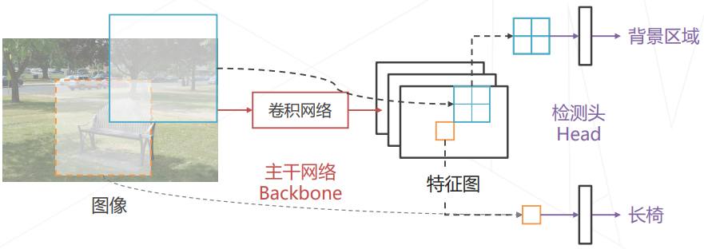
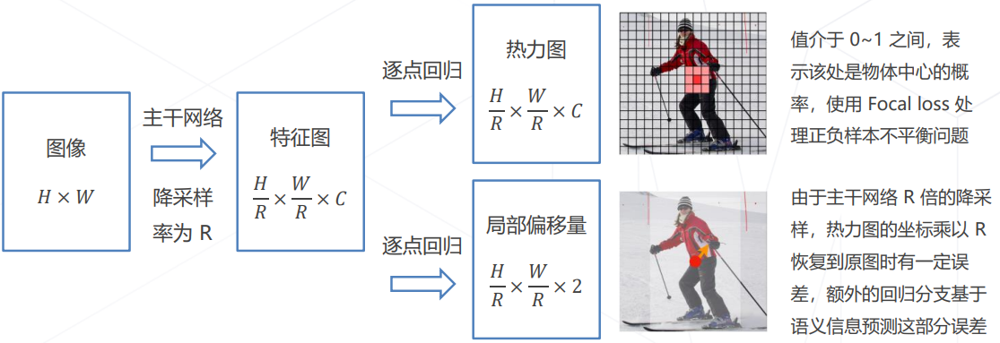

# OpenMMLab-AI训练营-4

## 1. 目标检测

给定一张图片, 用矩形框框出所有感兴趣的物体,同时预测物体类别.  
应用场景: 人脸识别, 智慧城市, 自动驾驶, 下游视觉任务.  
|       |                           图像分类                           |                        目标检测                        |
| :---: | :----------------------------------------------------------: | :----------------------------------------------------: |
| 相同  |          需要算法"理解"图像的内容,深度神经网络实现           |                                                        |
| 不同  | 通过只有一个物体,  通常位于图像中心,  通常占据主要面积 | 物体数量不固定,  物体位置不固定,  物体大小不固定 |

### 1.1 基本思路
1. 设定一个窗口;
2. 遍历所有位置的窗口, 用分类模型识别窗口的内容;  
3. 为了检测不同大小,不同形状的物体, 需要使用不同大小的窗口;  
缺点: 计算量大, 效率低;  
改进思路:
1. 使用启动式算法替换暴力遍历: 区域提议, 根据特征找出可能区域, 再用神经网络进行识别;
2. 减少冗余计算, 使用卷积网络实现密集预测: 用卷积一次性计算出所有特征, 再取出对应未知的特征完成分类;
  
原理: 不同特征的感受野自然形成了一系列等距分布的窗口;  
本质是一种隐式的滑窗方法.

### 1.2 基本范式
1. 两阶段方法: 基于区域, 以某种方式产生窗口, 再基于窗口内的特征进行预测;
2. 单阶段方法: 在特征图上基于单点特征, 实现密集预测;
  
都需要通过主干网络产生特征图,区别在于有没有窗口.

### 1.3 基础知识

1. 边界框Bounding Box  
    紧密包围感兴趣物体的框;  
    表达方式:
    1. 左上右下边界的坐标;
    2. 中心点坐标和长宽;
2. 交并比IOU  
   两矩形框交集面积与并集面积之比;
3. 置信度;
4. 非极大值抑制NMS:
    在物体周围的多个相近检测框内, 保留置信度最高的框;  
5. 边界框回归Bouding Box Regression:  
    降低滑窗和物体精准边界存在的偏差;  
6. 边界框编码Bbox Coding:
    对边界框的绝对偏移量进行归一化, 用于训练;

### 1.4 二阶段目标检测算法Two-Stage Detectors

代表作: R-CNN, Faster R-CNN, Mask R-CNN;
#### 1.4.1 流程:  
1. 区域提议;
2. 区域识别;
R-CNN, Fast R-CNN在区域识别的时候使用固定尺寸的输入, 这点不合逻辑.

#### 1.4.2 解决方法:
1. RoI Pooling:  
    将提议框划分为固定数目的格子, 再在格子内部进行池化, 得到固定尺寸的输出特征图;
2. RoI Align:  
    RoI Pooling在面对非整数坐标时, 取的是相邻的整数坐标, 不够精确;  
    RoI Align采取插值方法来取得每个采样点的精确特征;  

#### 1.4.3 朴素方法的局限:
1. 区域提议算法需要产生不同尺寸的提议框, 以适应不同尺寸的物体;
2. 物体可能存在重合, 区域提议算法需要在同一位置产生不同尺寸的提议框, 以适应重合的确情况;

#### 1.4.4 锚框 Anchor  
在原图上设置不同尺寸的基准框，称为锚框，基于特征独立预测每个锚框中是否包含物体
1. 可以生成不同尺寸的提议框
2. 可以在同一位置生成多个提议框覆盖不同物体

#### 1.4.5 特征金字塔

通过将高层特征融入低层特征，补充低层特征的语义信息, 来解决低层特征抽象级别不够的物体预测困难;  
    

### 1.5 单阶段目标检测算法One-Stage Detectors

代表作: YOLO, SSD, RetinaNet.  
单阶段算法直接通过密集预测产生检测框,相比于两阶段算法，模型结构简单、速度快，易于在设备上部署.  
#### 1.5.1 YOLO: You Only Look Once

主干网络：自行设计的 DarkNet 结构，产生 7×7×1024 维的特征图;  
检测头：2 层全连接层产生 7×7 组预测结果，对应图中 7×7 个空间位置上物体的类别和边界框的位置; 
每组边界框预测包含预测框位置信息和score信息;

损失函数计入了边界框回归损失(物体预测), 置信度回归损失(物体/背景预测)和类别概率回归损失(物体类别预测).

优点: 快, 速度是Faster R-CNN的3倍;  
缺点:  
1. 由于每个格子只能预测 1 个物体，因此对重叠物体、尤其是大量重叠的小物体容易产生漏检;
2. 直接回归边界框有难度，回归误差较大，YOLO v2 开始使用锚框;  

#### 1.5.2 SSD: Single Shot MultiBox Detector

单阶段方法的正负样本不均衡问题: 单阶段检测器没有区域提议的模块, 无法拒绝大量负样本;  
YOLO采取正负样本不同权重来解决;  
SSD通过困难负样本挖掘:选取分类损失最大的困难负样本计入损失;  

#### 1.5.4 RetinaNet

引入Focal Loss: $FL(p) = -(1 - p)^\alpha*log(p)$. 
使得简单负样本的损失降低.  

#### 1.5.5 无锚框目标检测算法Anchor-free Detectors

基于锚框
1. 模型基于特征预测对应位置的锚框中是否有物体，以及精确位置相对于锚框的偏移量;
2. 需要手动设置锚框相关的超参数（如大小、长宽比、数量等），设置不当影响检测精度;  
无锚框(Anchor-free)
1. 不依赖锚框，模型基于特征直接预测对应位置是否有物体，以及边界框的位置;
2. 边界框预测完全基于模型学习，不需要人工调整超参数;

#### 1.5.6 FCOS, Fully Convolutional One-Stage
引入中心度来判断预测框的优劣;推理阶段：$置信度=\sqrt{中心度×分类概率}$，以过滤低质量预测框;  
几何意义：位置越靠近边界框中心越接近 1，越靠近边界越接近 0
损失函数:位置的分类损失使用Focal loss, 前景样本的边界框回归损失使用IoU loss, 前景样本的Center-ness值使用 BCE loss.
#### 1.5.7 CenterNet
针对 2D 检测的算法，将传统检测算法中的“以框表示物体”变成“以中心点表示物体”，将2D检测建模为关键点检测和额外的回归任务.  
一个框架可以同时覆盖 2D 检测、3D 检测 、姿态估计等一系列任务.

### 1.6 Detection Transformers

1. DERT:脱离密集预测范式，将检测建模为从特征序列到框序列的翻译问题，用Transformer模型解决;
2. Deformable DETR:借鉴Deformable Conv的方式，显示建模query注意的位置.收敛速度更快;

### 1.7 目标检测模型的评估方法

假阳性FP: 错检, 过杀; 假阴性: 漏检, 漏杀;  
$recall = {TP \over TP+FN}$  
$precision = {TP \over TP+FP}$  

PR曲线:
1. 检测框按置信度排序，取前 K 个框计算 Precision 和 Recall;
2. 遍历 K 从 1 至全部检测框，将得到的 Precision 和 Recall 值绘制在坐标系上，得到 PR 曲线; 
 
Average Precision = Precision 对 Recall 的平均值，即 PR 曲线下的面积，作为检测器的性能衡量指标.  
为了避免起伏的影响, 计算面积前需要插值;  
MeanAP: 分类别统计AP，并按类别平均即得到 Mean AP;  
在不同的 IoU 阈值下计算 Mean AP，得到 $AP^{50}$, $AP^{75}$等指标, 可衡量检测器在不同定位精度要求下的性能.
